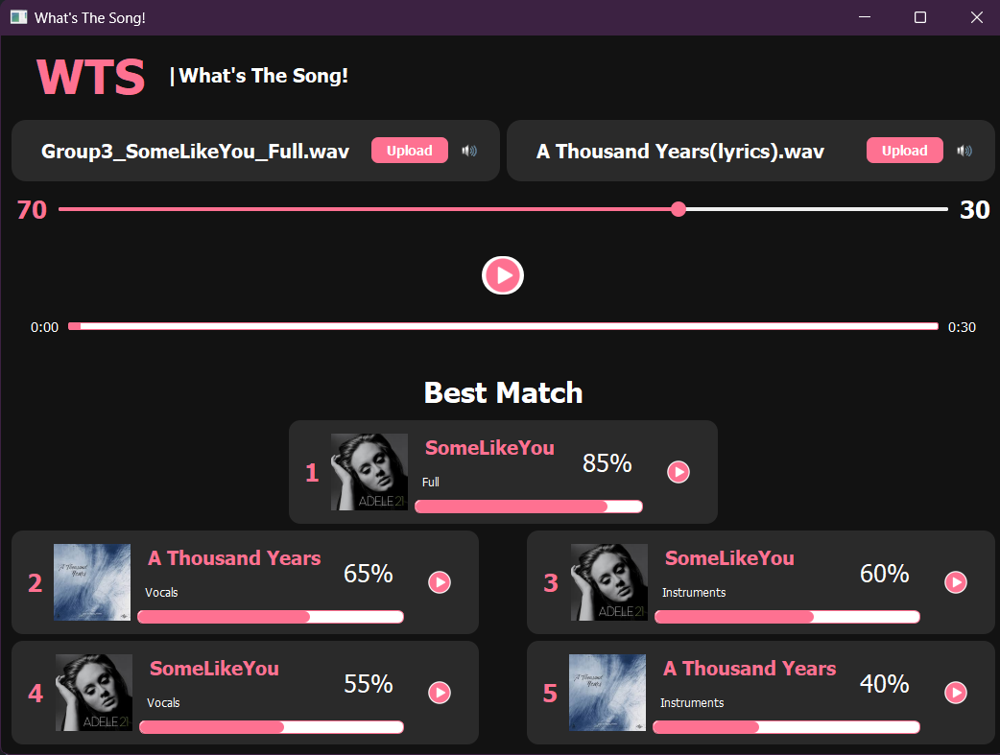
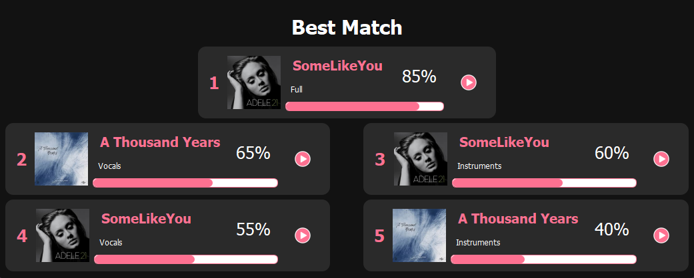

<h1 align="center">
    
</h1>

<h1 align="center">WTS | What The Song</h1>
<h3 align="center">Audio Signal Fingerprinting and Similarity Detection Tool</h3>

<h4 align="center">
	 Status: In Progress
</h4>

<p align="center">
 <a href="#about">About</a> •
 <a href="#features">Features</a> •
 <a href="#how-it-works">How it works</a> •
 <a href="#tech-stack">Tech Stack</a> •  
 <a href="#developers">Developers</a>
</p>

# About

**WTS | What The Song** is a Python and PyQt5-based desktop app that generates audio fingerprints to detect and rank song similarity using audio signal features. The tool processes songs by generating spectrograms, extracting features, and applying perceptual hash functions—a method of creating compact representations that preserve perceptual similarity in audio—to identify and compare audio tracks.

---

## Features

- **Spectrogram Generation**: Automatically generates spectrograms for the first 30 seconds of each song. Three types of spectrograms are created:
  - **Full Song**
  - **Music Only**
  - **Vocals Only**

- **Feature Extraction**: The Extracted key audio features are the peaks of spectrogram which is the regions where the frequency is most dominant.

- **Perceptual Hashing**: Uses perceptual hash functions to create compact representations of audio features for efficient similarity detection.

- **Similarity Detection**: Compares input audio files against a database of songs and generates a ranked list of similar songs with a similarity index.

- **Weighted Average Combination**: Allows users to combine two audio files using a slider to control the weighting percentage. The combined result is treated as a new input for similarity detection.

<p align="center">
  
</p>

- **Interactive GUI**: Provides a user-friendly interface with:
  - File selection for input songs
  - Real-time similarity results
  - Slider for weighted audio combination

---

## Tech Stack

The following tools were used in the construction of the project:

- **[Python](https://www.python.org/)**
- **[PyQt5](https://riverbankcomputing.com/software/pyqt/intro)**
- **[NumPy](https://numpy.org/)**
- **[Librosa](https://librosa.org/)**
- **[Matplotlib](https://matplotlib.org/)**
- **[Pandas](https://pandas.pydata.org/)**

---

## How it Works

The application is built with **Python** and **PyQt5**. It iterates through a collection of songs to generate spectrograms and extract features, storing the results in a local database. When an input file is provided, the application computes its fingerprint and lists similar songs based on a similarity index.

### Pre-requisites

Before running the application, make sure you have **Python** installed on your system. You will also need **pip** for installing dependencies.

---

## How to Run the Project Locally

To run the project locally, follow these steps:

### Steps:

2. **Navigate to the project folder:**
   ```bash
   cd WTS
   ```

3. **Install the required dependencies:**
   ```bash
   pip install pyqt5 numpy librosa matplotlib pandas
   ```

4. **Run the application:**
   ```bash
   python main.py
   ```

This will start the **WTS | What The Song** application locally.

---

## Developers

| [**Talal Emara**](https://github.com/TalalEmara) | [**Meram Mahmoud**](https://github.com/Meram-Mahmoud) | [**Maya Mohammed**](https://github.com/Mayamohamed207) | [**Nouran Hani**](https://github.com/Nouran-Hani) | [**Nariman Ahmed**](https://github.com/nariman-ahmed) |
|:------------------------------------------:|:------------------------------------------:|:------------------------------------------:|:------------------------------------------:|:------------------------------------------:|

---

## Learn More

To learn more about audio signal processing and PyQt5, check out the following resources:

- [Librosa Documentation](https://librosa.org/doc/latest/index.html)
- [PyQt5 Documentation](https://riverbankcomputing.com/software/pyqt/intro)
- [Matplotlib Documentation](https://matplotlib.org/stable/contents.html)

